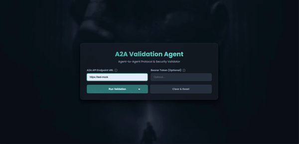

# A2A Validation Agent

A comprehensive agentic system designed to validate Agent-to-Agent (A2A) communication implementations. This tool checks for compliance with protocol standards and tests for common security vulnerabilities, ensuring your agent's API is robust, secure, and reliable.

The system is built with the Google Agent Development Kit (ADK) and provides a simple web interface for initiating tests and viewing clear, structured results.





## Key Features

*   **A2A Protocol Validation:** Performs in-depth checks for authentication standards, correct message formatting, and proper HTTP method compliance.
*   **OWASP LLM Security Checks:** Includes basic validation against common LLM vulnerabilities, specifically Prompt Injection (LLM01) and Insecure Output Handling (LLM04).
*   **Simple Web Interface:** An intuitive UI allows you to easily enter an agent's endpoint, provide credentials, and run the validation suite.
*   **Live Request Logging:** View the HTTP requests and responses in real-time as the tests are being executed.
*   **Downloadable Reports:** Generate and download a detailed Markdown report of the validation results for offline analysis and record-keeping.
*   **ADK-Powered:** Built on the robust and scalable Google Agent Development Kit.

## Prerequisites

Before you begin, ensure you have the following installed:
*   Python (3.9 or newer recommended)
*   `git` for cloning the repository
*   `venv` module for creating virtual environments (usually included with Python)

## Installation

Follow these steps to set up the project on your local machine:

1.  **Clone the repository:**
    ```bash
    git clone https://github.com/your-username/a2a-validation-agent.git
    cd a2a-validation-agent
    ```

2.  **Create and activate a virtual environment:**
    This isolates the project dependencies from your global Python installation.

    *   On macOS/Linux:
        ```bash
        python3 -m venv venv
        source venv/bin/activate
        ```
    *   On Windows:
        ```bash
        python -m venv venv
        venv\Scripts\activate
        ```

3.  **Install the required dependencies:**
    ```bash
    pip install -r requirements.txt
    ```

## Usage

1.  **Run the agent:**
    Execute the following command from the root directory of the project (`/a2a-validation-agent`):
    ```bash
    python -m src
    ```
    Alternatively, for development with auto-reloading, you can use `uvicorn`:
    ```bash
    uvicorn src.agent:app --reload
    ```
    The server will start, typically on `http://127.0.0.1:8000`.

2.  **Access the User Interface:**
    Open your web browser and navigate to `http://127.0.0.1:8000`.

3.  **Run a Validation Test:**
    *   In the "A2A API Endpoint URL" field, enter the full URL of the agent endpoint you wish to test.
    *   If the endpoint requires authentication, provide a valid Bearer Token in the optional field.
    *   Click the "Run Validation" button.

4.  **View Results:**
    *   The validation results will appear on the page, categorized into "A2A Protocol Validation" and "OWASP Security Checks".
    *   A live log of all requests made during the validation will also be displayed.
    *   Click the "Download Report" button to save a copy of the results in Markdown format.

## Technical Stack

*   **Agent Framework:** Google Agent Development Kit (ADK)
*   **Web Framework:** FastAPI
*   **HTTP Client:** httpx
*   **Schema Validation:** Pydantic
*   **Testing:** Pytest, pytest-httpx